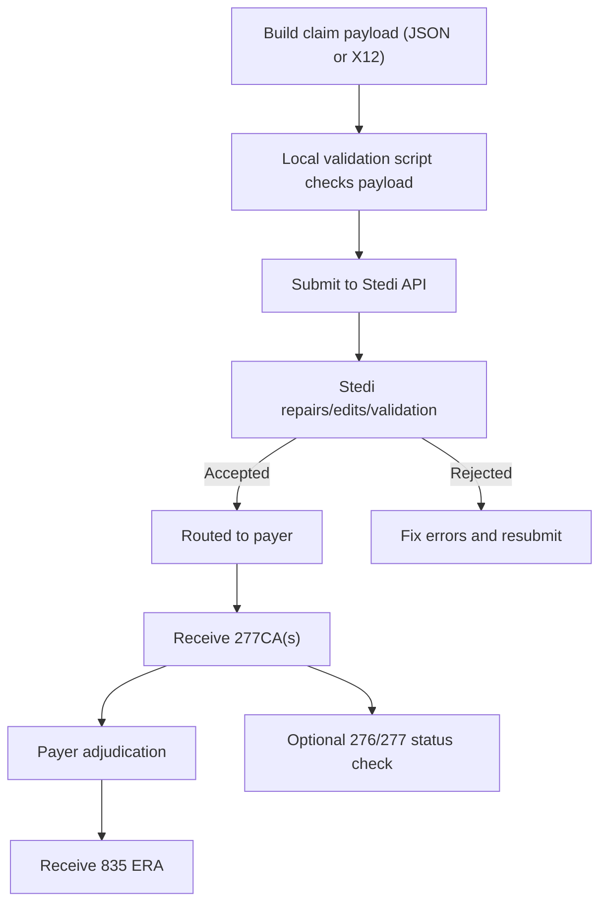

# Stedi Overview

## Table of Contents
- What Stedi is
- Core claim transaction types
- Submission methods
- Claim lifecycle
- Response retrieval options
- Billing and non-billable scenarios
- Which reference file to read next

## What Stedi is

Stedi is a healthcare clearinghouse platform for HIPAA X12 transactions. For claims, it helps you submit data in JSON or X12, validates the submission against industry and payer-specific rules, routes claims to payers, and returns response data in machine-friendly formats.

For API workflows, Stedi can accept JSON and translate it to X12 for payer delivery. This is usually the best path for deterministic scripts that need predictable request and response handling.

## Core claim transaction types

- `837P`: Professional claims
- `837I`: Institutional claims
- `837D`: Dental claims
- `275`: Claim attachments (when required)
- `277CA`: Claim acknowledgment (accept/reject for processing)
- `835`: Electronic Remittance Advice (adjudication/payment details)
- `276/277`: Real-time claim status check transactions

## Submission methods

- **API (recommended for this skill):** Deterministic, scriptable, supports JSON and raw X12.
- **SFTP:** Good when your system already produces X12 files.
- **Portal UI:** Useful for manual QA/debugging and operational workflows.

For this skill, default to API-first behavior and deterministic scripts for validation, submission, polling, and response parsing.

## Claim lifecycle

Important distinction:
- A `277CA` acceptance means accepted for processing, not paid.
- Final payment/denial outcomes are in `835` (and sometimes additional status responses).

## Response retrieval options

- **Webhooks (recommended):** Near real-time and operationally cleaner.
- **Polling:** Call polling APIs with cursor/date tracking.

If using webhooks, your receiver must handle retries and deduplicate events.

## Billing and non-billable scenarios

Stedi generally bills successful processing usage per contract terms. Typical non-billable scenarios include API calls that return `4xx` or `5xx` errors (for example, unsupported payer/transaction combinations). Always verify contract terms for your account.

## Which reference file to read next

- Need submission fields/endpoints: `stedi-submitting-claims.md`
- Need interpretation of 277CA/835: `stedi-claim-responses.md`
- Need practical guardrails: `stedi-best-practices.md`
- Need fixes/resubmissions/lifecycle ops: `stedi-claim-lifecycle.md`
- Need enrollment/payer setup details: `stedi-enrollment-and-payers.md`
- Need test workflows: `stedi-testing.md`
- Need attachments and MCP context: `stedi-attachments-and-mcp.md`
